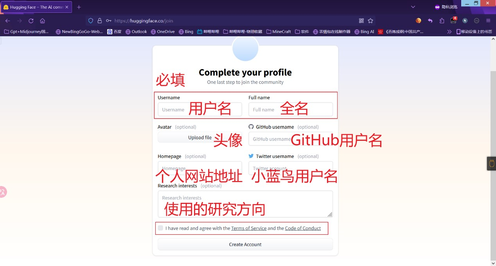

# huggingface注册

> 原文：https://github.com/Harry-zklcdc/go-proxy-bingai/wiki/HuggingFace-%E9%83%A8%E7%BD%B2

1.打开https://huggingface.co

注意，这个网站需要魔法方法

2.右上角`sign up`

3.填写一个能查收邮件的邮箱；

可以使用qq邮箱，gmail，Outlook等

4.填写信息：

> - `Username`：用户名**（必填）**；
> - `Full name`：全名**（必填）**；
> - `Avatar`：头像（下面的是上传图片文件）；
> - `GitHub username`：GitHub用户名；
> - `Homepage`：个人网站或博客地址；
> - `Twitter username`：推特用户名；
> - `Research interests`：感兴趣的研究方向；

5.查收邮件，完成账户激活

（完成后会有条绿色横幅告诉你成功了）。

