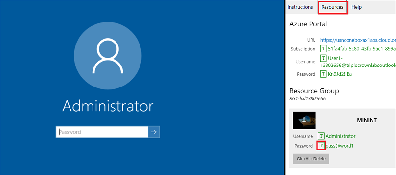

# 通过微软虚拟机过人机验证

原文地址：https://github.com/Harry-zklcdc/go-proxy-bingai/wiki/%E9%80%9A%E8%BF%87%E5%BE%AE%E8%BD%AF%E8%99%9A%E6%8B%9F%E6%9C%BA%E8%BF%87%E4%BA%BA%E6%9C%BA%E9%AA%8C%E8%AF%81

## 登陆微软虚拟机

地址：[微软虚拟机](https://learn.microsoft.com/zh-cn/training/modules/implement-common-integration-features-finance-ops/10-exercise-1)

按照网页中的图文教程登陆到虚拟机，大概步骤如下：

- 选择**启动 VM 模式**。
- 在实验侧边栏上的**Resources**选项卡中，在 **MININT** 框中选择**密码**旁边的 **T** 图标，以便为您输入虚拟机的管理员密码。


- 打开新版Edge浏览器。

## 登陆Bing

- 在虚拟机的新版Edge浏览器中打开Bing。

进入首页网址点击 CHAT。

```
https://www.bing.com
```

或者直接打开聊天网址：

```
https://www.bing.com/search?q=Bing+AI&showconv=1&FORM=hpcodx
```

- 点击 Sign in 登陆自己的微软账号。

- 随便发送一句话进行聊天。

- 获取cookie。

  详见 [获取cookie教程](bingcookie.html)

## PS

微软虚拟机可以访问www.bing.com，每次可以使用2小时。不限使用次数。
