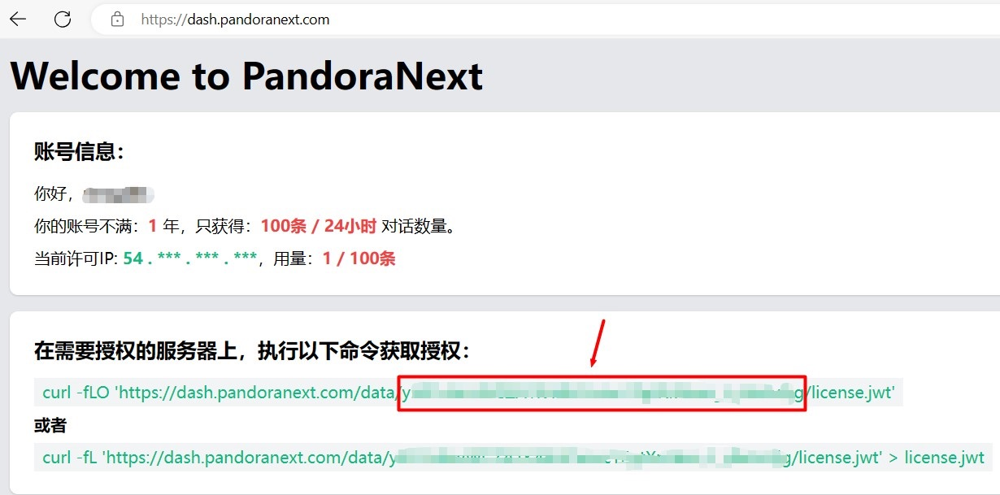
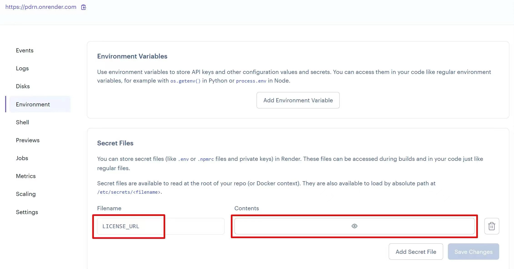

# 在render部署pandora-next

以下是大致的部署思路，不适合零基础的新手阅读。

另外render对bing的封锁很严，==只要fork过==go-proxy-bingai，bingo，chat-sydney的很大几率会被封号，我已经被封了三个了。

## 1.获取license.jwt文件

在这里获取：https://dash.pandoranext.com

记住圈出来这一部分，后续作为机密环境变量。



## 2.fork项目pdrn

项目地址 https://github.com/renqabs/pdrn

点击下面的网址fork到自己的仓库

https://github.com/renqabs/pdrn/fork

2.1【可选步骤】修改config.json

如果不想其他人使用你部署的镜像，可以给网站添加一个密码，需要修改 site_password 的值

```
{
  "bind": "0.0.0.0:8080",
  "timeout": 600,
  "proxy_url": "",
  "public_share": false,
  "site_password": "your_password",
  "whitelist": null
}
```

### 3.登陆render

https://render.com/

在Environment 中 新建一个Secret Files

Filename填写 `LICENSE_URL`

Contents的内容填写第1步中的内容



## 4.部署完成

部署完成以后会自动分批一个域名给你

## 5.备注-核心代码

Dockerfile

```
# 使用基础镜像
FROM golang:alpine AS builder

# 安装必要的工具
RUN apk update && apk add --no-cache \
    curl \
    tar

# 创建新的工作目录
WORKDIR /app

# 下载并解压文件，并给予所有用户读写和执行权限
RUN curl -LO https://github.com/pandora-next/deploy/releases/download/v0.2.0/PandoraNext-v0.2.0-linux-amd64-f1585a2.tar.gz \
    && tar -xzf PandoraNext-v0.2.0-linux-amd64-f1585a2.tar.gz --strip-components=1 \
    && rm PandoraNext-v0.2.0-linux-amd64-f1585a2.tar.gz \
    && chmod 777 -R .
    
# 等待3分钟，获取授权
# RUN sleep 1m\
RUN --mount=type=secret,id=LICENSE_URL,dst=/etc/secrets/LICENSE_URL \
    curl -fLO https://dash.pandoranext.com/data/$(cat /etc/secrets/LICENSE_URL)/license.jwt
RUN chmod 777 license.jwt

# 下载config.json文件，并给予所有用户读写和执行权限
COPY config.json .
RUN chmod 777 config.json

# 修改PandoraNext的执行权限
RUN chmod 777 ./PandoraNext

# 创建全局缓存目录并提供最宽松的权限
RUN mkdir /.cache && chmod 777 /.cache

# 开放端口
EXPOSE 8080

# 启动命令
CMD ["./PandoraNext"]
```

config.json

```
{
  "bind": "0.0.0.0:8080",
  "timeout": 600,
  "proxy_url": "",
  "public_share": false,
  "site_password": "",
  "whitelist": null
}
```

